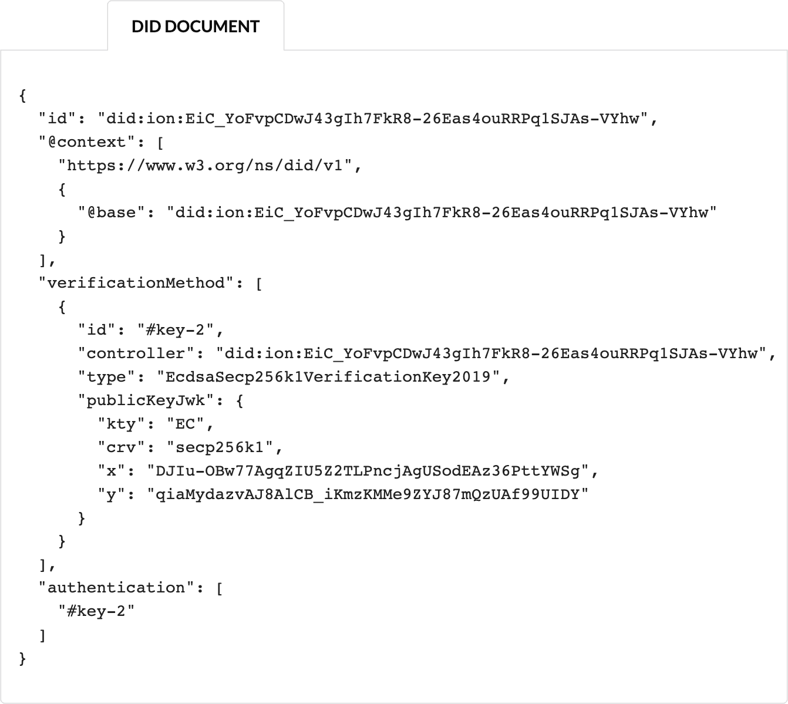

# did:ion Usage Examples

This repo includes usage instructions and accompanying code that demonstrate common operations for developers working
with ION DIDs and the ION network.

## Installation

Tested with Node.js engine v18 LTS.

```bash
git clone https://github.com/frankhinek/did-ion-examples.git
cd did-ion-examples
npm install
```

## Usage

> <br>
> This guide does not take into account private key management best practices. DIDs created using the code provided
> in this repo should be used only for testing purposes.

### Create and Anchor ION DID

Start by generating a key pair.  The public key will be published in the DID document as a verification method which
can be used to authenticate interactions with the DID subject.

```bash
node src/generate-key-1.js
```


The script will write out to file:
- `key-1-privateKey.json`: Private key JWK
- `key-1-publicKey.json`: Public Key JWK

Next, using [ion-tools](https://github.com/decentralized-identity/ion-tools), generate an
ION DID using the previously created public key JWK, generate a `create` operation
request, and anchor by publishing to an ION node.

```bash
node src/create-ion-did.js
```


The script will write out to file:
- `did-ion-id.txt`: The short and long forms of the did:ion URI.
- `did-ion-operations-v1.json`: DID document content and public/private JWKs used for update and recovery operations.

It may take an hour or more for the ION DID to be anchored and resolvable, but you will eventually be able to resolve
the DID document using the [DIF Universal Resolver](https://dev.uniresolver.io/).  For example,
[click here](https://dev.uniresolver.io/#did=did:ion:EiC_YoFvpCDwJ43gIh7FkR8-26Eas4ouRRPq1SJAs-VYhw) to resolve the DID
document of the DID generated during the writing of this guide:


### Replace Verification Method Key

After you confirm your ION DID is anchored and resolvable, `update` operations can be performed to add or remove keys
and services expressed in the DID document. To facilitate this capability a public and private JWK denoted for use in
update operations was created when you generated the ION DID.  You can inspect these keys by viewing the
`did-ion-operations-v1.json` file.  Only the holder of the `update` private key is able to make updates to the published
ION DID document.

For this example, we will **remove** the verification method key identified as `#key-1` in the DID document and **add**
a new key with an `id` of `#key-2`.

Since we need a new keys to reference in this update operation, start by generating a new key pair:

```bash
node src/generate-key-2.js
```


The script will write out to file:
- `key-2-privateKey.json`: Private key JWK of key 2
- `key-2-publicKey.json`: Public Key JWK of key 2

Now that you've got a new public key, run `update-ion-key.js` to:
- Read in the saved operation state from `did-ion-operations-v1.json`.
- Construct a DID instance using the saved state.
- Read in the public JWK from `key-2-publicKey.json`.
- Generate an `update` operation and request to remove `key-1` and add `key-2`.
- Submit the request to an ION node to publish.
- Get the updated ION operations for the DID and write to `did-ion-operations-v2.json`.

```bash
node src/update-ion-key.js
```


Note that the private key of the `update` operation is used to sign the request that is published by an ION node.  It is
recommended by the protocol specification that operation keys not be re-used, so in the process of generating the
request, a new `update` key pair is generated.  Any future update operations should use these keys to sign requests,
which is why the script saves the revised operations state.

The script will write out to file:
- `did-ion-operations-v2.json`: Prior DID content and operation keys with the new pair of update keys appended.

Similar to the create operation, it may take an hour or longer before the revised DID document to resolvable.  The
DID document post update will appear as follows:



## Credit Attribution

Some of the code examples in this repo are based on the following content:

- [Create ION DID](https://github.com/bgins/create-ion-did) by [bgins](https://github.com/bgins)
- [Tutorial: How to create a DID on the ION network](https://medium.com/@a.a.lechner/tutorial-how-to-create-a-did-on-the-ion-network-d4b8ebca280a) by [Alexander Lechner](https://medium.com/@a.a.lechner?source=post_page-----d4b8ebca280a--------------------------------)